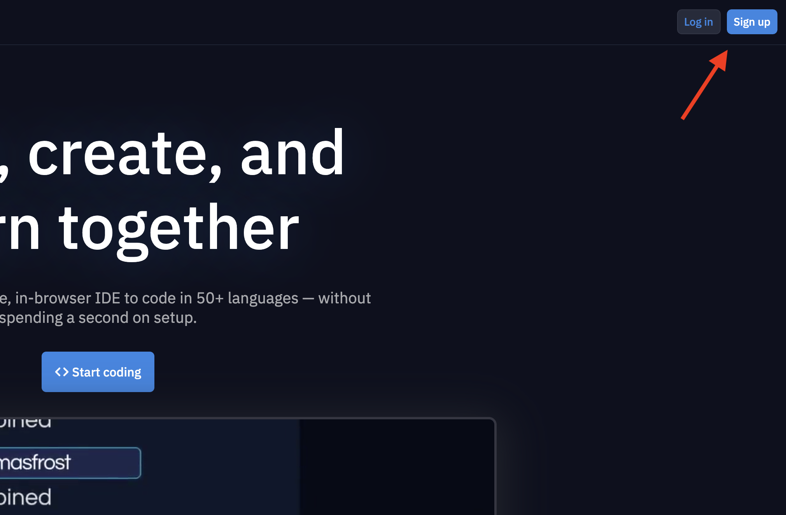
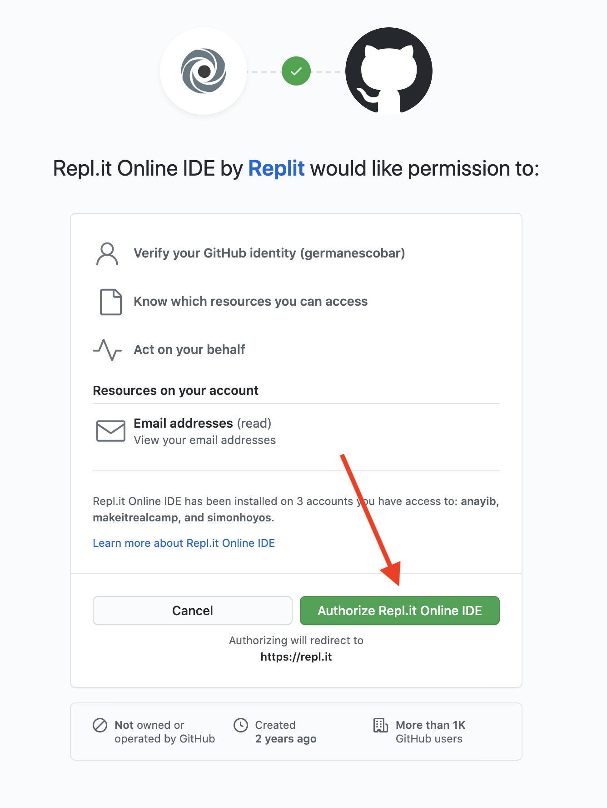
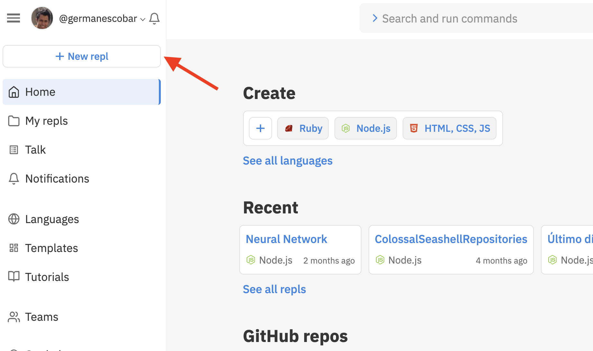
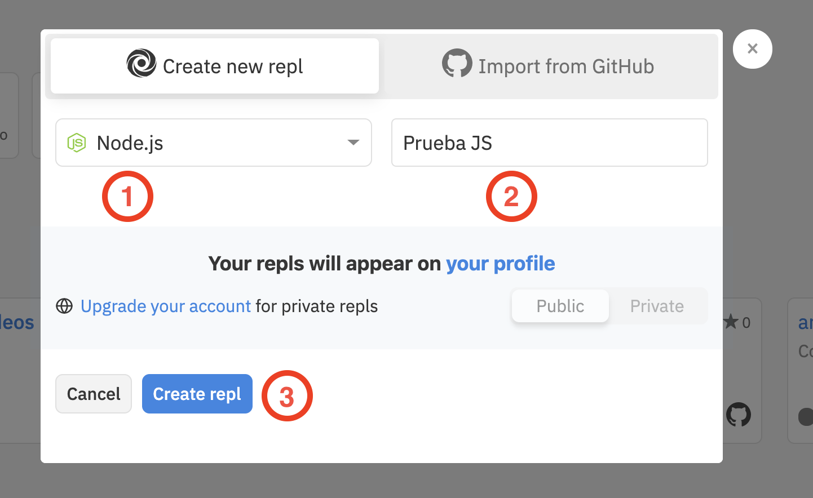

# Instrucciones Repl

Repl es un editor de texto online que también nos permite ejecutar programas. De esta forma no necesitas instalar nada en tu computador para hacer el curso.

Para utilizar Repl sigue estas instrucciones:

1. Si aún no tienes cuenta en Github debes crear una: https://github.com/.
2. Entra a https://repl.it y oprime el botón Sign Up:

  

  

3. Si no estás autenticado en Github te pedirá tu usuario y contraseña primero. Después aparecerá una pantalla como la siguiente:

  

4. Crea tu primer proyecto:

  

  
